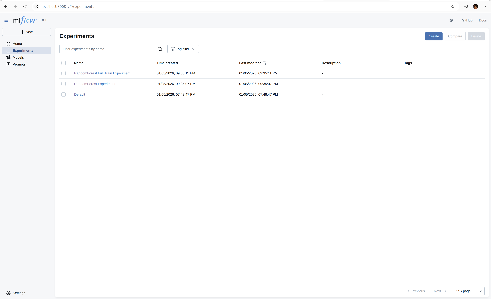
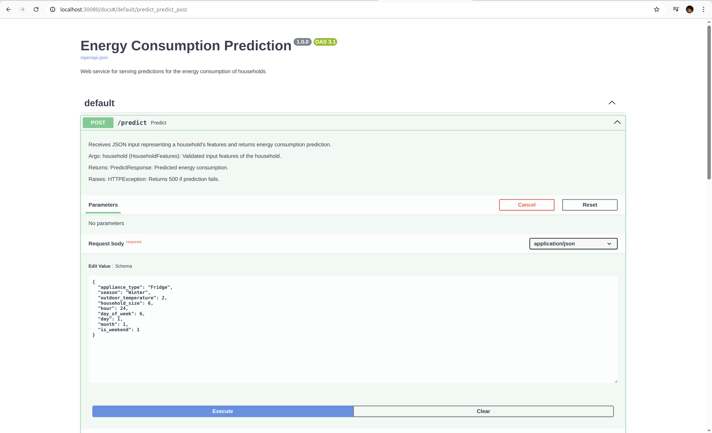

# ENERGY CONSUMPTION PREDICTION MACHINE LEARNING CAPSTONE PROJECT

## Problem Statement

Energy consumption forecasting is a fundamental problem in modern energy management systems, as it directly supports efficient resource allocation, cost reduction, and sustainability initiatives. With increasing energy demand and variability in household usage patterns, traditional rule-based or aggregate forecasting approaches are often insufficient to capture the complex relationships between time, environmental conditions, appliance usage, and household characteristics.

This project focuses on developing a machine learning–based predictive model to estimate household energy consumption using historical data. The dataset used was sourced from Kaggle and contains approximately 100,000 records of household energy usage. Each record includes attributes such as home_id, appliance_type, historical energy_consumption_kwh, timestamp information (date and time), outdoor_temperature, season, and household_size. The target variable for the prediction task is energy consumption.

A significant challenge in this problem is effectively modelling the temporal dynamics of energy usage. Energy consumption varies not only across households and appliances, but also across different times of day, days of the week, and seasons. To address this challenge, feature engineering was applied to extract granular temporal features from the raw timestamp data, including day, day of week, hour, and minute. These engineered features enable the models to learn cyclical and behavioural consumption patterns more effectively.

Several supervised machine learning models were trained and evaluated, including Decision Tree, Random Forest, and XGBoost. Comparative evaluation showed that the Random Forest model achieved the best predictive performance, indicating its effectiveness in capturing non-linear relationships and interactions between features in the dataset.

The final model is intended to serve as a predictive tool for estimating household energy consumption based on historical, environmental, and temporal factors. This solution can be used to support energy demand forecasting, identify high-consumption patterns, and inform decision-making in energy management and optimisation systems.

## Project Objectives

The key objectives of this project are:

To analyse household energy consumption data and identify key factors influencing energy usage.

To apply feature engineering techniques to improve representation of temporal and contextual information.

To train and compare multiple machine learning models for energy consumption prediction.

To evaluate model performance and select the most effective predictive model.

To develop a reusable prediction model that can support energy planning and management use cases.

To integrate experiment tracking in model training

To run model training using workflow orchestration

To deploy model serving web API to Kubernetes - local and EKS

To automate the deployment of model serving web service using CI/CD

To integrate GitOps to model service deployment

To configure observability for web API

To route traffic in Kubernetes cluster using ingress controller

## Scope and Limitations

1. Scope

The project focuses on supervised machine learning approaches for regression-based energy consumption prediction.

Predictions are based on historical consumption, household attributes, appliance type, environmental conditions, and engineered time features.

Model evaluation is performed using standard performance metrics to compare multiple algorithms.

2. Limitations

The dataset is sourced from Kaggle and may not fully represent real-world energy usage across all geographic regions or household types.

External factors such as energy pricing, occupancy behaviour changes, or unexpected events are not included in the dataset.

The model’s performance is dependent on the quality and completeness of historical data and may require retraining for deployment in different contexts.

###################################################

## Model Training

Model training was achieved by following the following steps:

### Data Loading

The dataset for the task was sourced from Kaggle, and loaded into Jupyter notebook (`./capstone.ipynb`)using pandas library. There were 100,000 records total.

### Exploratory Data Analysis

To understand the dataset better, I did some analysis to find out:
- null values

- duplicate records

- existing columns and their data types

- description of the numerical columns

- values count for categorical columns

- distribution of the target variable - skewed to the right


### Data Cleaning

The dataset required only very minimal cleaning as there were no null or duplicate values. The columns were renamed to remove spacing and special characters.

### Feature Engineering

The date and time columns were converted to the `datetime` data type, and then combined to give a singular timestamp.

Both columns were merged into a `timestamp` column which was subsequently splitted into - `hour`, `minute`, `day_of_week`, `day`, `month`, `is_weekend`.

Feature importance was also done to determine the features to include in model training.

### Train Multiple Models

Multiple models were trained -

* Decision Trees

* RandomForest

* XGBoost

RandomForest gave the best Root Mean Squared Error - `RMSE`

### Experiment Tracking

Experiment tracking was done using `mlflow` which was installed using `UV`. Each of the 3 model above and their best paramenters, was trained within an experiment

and their parameters, `RMSE` scores, and artifact (DV and model) were logged to MLFlow server. MLFlow was later ran in Docker during deployment, to achieve

portability and reusability.

### Training Pipeline

The notebook used for the initial models training and experimentation was converted to a Python script and saved in `./train_pipeline/pipeline.py`.

`Prefect` was also used to orchestrate the training workflow.

To run the pipeline without docker:

* Navigate to the directory `capstone-project`, and run:

```bash
uv sync
```

Also run the API using docker:

```bash
cd server

docker build -t 
```

* Start mlflow server with the command:

```bash
uv run mlflow server --backend-store-uri sqlite:///mlflow.db --host 0.0.0.0 --port 5000 \
--cors-allowed-origins "*" \
--x-frame-options NONE \
--disable-security-middleware
```

* Access MLFlow on `http://localhost:5000`

* Run the train pipeline with the commands:

```bash
uv run python train_pipeline/pipeline.py 

uv run prefect deployment run 'training-flow/energy-consumption-training-pipeline'       # On a different terminal to trigger the flow manually
```

* Visit `http://localhost:4200` to view the flow

To run the pipeline using docker:

* Build the docker image of the pipeline as follow:

```bash
cd train_pipeline

docker build -t <IMAGE_NAME>:<IMAGE_TAG> .
```

* Run MLFlow, Prefect server and training pipeline docker container

```bash
cd train_pipeline

docker-compose up
```

### Web Service

To serve or use the model, a web server was created using `FastAPI`. The path is `./server/predict.py`.

The web service downloads the model from the model registry and uses it.

To run the web service, first run MLFlow server. Then run:

```bash
cd server

uv run python predict.py
```

Access the API on `http://localhost:8000/docs`, and test.

You can also test using a custom Python script - `server/client.py`.

Unit tests have also been provided in `tests/test_server.py` to test the functions in the web app

To run the tests, first ensure that MLFlow  and the web app are running.

Then:

```bash
uv run pytest
```

Run web service using docker:

```bash
cd server

docker-compose up
```

### Local Deployments - Kind

To deploy the entire stack to a local Kubernetes cluster, do the following:

* Create a cluster with `kind`

```bash
kind create cluster --name ml --config kubernetes/local/kind/kind-config.yaml
```


======================================


======================================


* Apply the Kubernetes files in `./kubernetes/local` in the order mlflow >> prefect >> train-pipeline >> server

```bash
cd kubernetes/local

kubectl apply -f mlflow/deployment.yaml

kubectl apply -f mlflow/service.yaml

kubectl apply -f prefect/deployment.yaml

kubectl apply -f prefect/service.yaml

kubectl apply -f train-pipeline/deployment.yaml

kubectl apply -f server/deployment.yaml

kubectl apply -f server/service.yaml

kubectl apply -f server/hpa.yaml
```

========================================


========================================


=========================================


========================================



=========================================



=========================================


=========================================


### CI Pipeline

THE CI pipeline (GitHUb Actions) get triggered when a merge to `main` branch occurs.

The pipeline runs the following steps:

- Unit testing

- Dependency check with Safety

- Source Code Analysis with SonarQube

- Quality Gate with SonarQube

- Docker Build

- Image scanning with Trivy

- Docker push

- Update Kuberenetes manifest files

SonarQube scanning and quality gate checks were achieved by setting up a SonarQube server on EC2 instance, and using docker to run the service.

The infrastructures for this were set up using `Terraform`, and the configuartions are in `./infrastructures` directory.

To run:

```bash
cd infrastructures

terraform init

terraform plan

terraform apply --auto-approve
```

First create an SSH key pair on AWS and reference this in the terraform congiuration to enable SSH access.

Copy the EC2 instance's public IP address and access the instance by running:

```bash
ssh -i <SSH_PRIVATE_KEY_PATH> ubuntu@<IP_ADDRESS>
```

Run the following to get SonarQube up:

```bash
sudo apt install docker.io

sudo usermod -aG docker $USER

newgrp docker 

docker run --name sonarqube -p 9000:9000 -d sonarqube:10.6-community
```

Visit <IP_ADDRESS>:9000 to view the SonarQube UI.

Provide username - `admin`, password - `admin`, and change the password.

Navigate to your profile >> My Account >> Security, and generate a token for CI access. Copy the token.

On your GitHub repository, navigate to settings >> Secrets and Variables >> Actions >> Repository Secrets, and provide the following:

- DOCKERHUB_TOKEN : DockerHub password

- DOCKERHUB_USERNAME : DockerHub username

- SONAR_HOST_URL : http://<SONARQUBE_SERVER_IP>:9000

- SONAR_TOKEN : The SonarQube token

### GitOps

GitOps is achieved by integrating `ArgoCD`, which is deployed to the same Kubernetes cluster that runs the web API.

ArgoCD picks up changes that occur to the Kubernetes manifest files into the cluster.

To implement:

* Install ArgoCD to cluster

```bash
kubectl create namespace argocd

kubectl apply -n argocd -f https://raw.githubusercontent.com/argoproj/argo-cd/stable/manifests/install.yaml

kubectl get pods -n argocd

kubectl port-forward svc/argocd-server -n argocd 8080:443             ## To access the ArgoCD UI

kubectl -n argocd get secret argocd-initial-admin-secret -o jsonpath="{.data.password}" | base64 -d; echo               ## Retrieve password
```

* Visit ArgoCD ui on `localhost:8080`, create an App and connect it with your GitHub repository

### Cloud Deployments - EKS
To deploy this project stack - MLFlow, Prefect Server, Training Pipeline and Model serving web API to the cloud, I leveraged Amazon EKS.

The following steps have been applied:

* Create a cluster without any worker node using `eksctl`. Note `eksctl` and the `AWS CLI` need to be installed first.

```bash
eksctl create cluster --name=ml-capstone \
                      --region=us-east-1 \
                      --zones=us-east-1a,us-east-1b \
                      --without-nodegroup
```

* Attach an OIDC provider

```bash
eksctl utils associate-iam-oidc-provider \
    --region us-east-1 \
    --cluster ml-capstone \
    --approve
```

* Attach a node group (worker node):

```bash
eksctl create nodegroup --cluster=ml-capstone \
                        --region=us-east-1 \
                        --name=ml-capstone-ng-private \
                        --node-type=t3.medium \
                        --nodes-min=1 \
                        --nodes-max=1 \
                        --node-volume-size=20 \
                        --managed \
                        --asg-access \
                        --external-dns-access \
                        --full-ecr-access \
                        --appmesh-access \
                        --alb-ingress-access \
                        --node-private-networking
```

* Update local `kubeconfig` file:

```bash
aws eks update-kubeconfig --name ml-capstone
```

* Deploy the project stack

```bash
cd kubernetes/eks

kubectl apply -f mlflow/deployment.yaml

kubectl apply -f mlflow/service.yaml

kubectl apply -f prefect/deployment.yaml

kubectl apply -f prefect/service.yaml

kubectl apply -f train-pipeline/deployment.yaml

kubectl apply -f server/deployment.yaml

kubectl apply -f server/service.yaml

kubectl apply -f server/hpa.yaml
```

* Fetch the loadbalancer DNS name from AWS console, and visit `<LOADBALANCER_DNS>:8000` to see the web API UI

* Integrate `Kubernetes Ingress Controller` for proper routing
############################################################

* Install ArgoCD for GitOps

```bash
kubectl create namespace argocd

kubectl apply -n argocd -f https://raw.githubusercontent.com/argoproj/argo-cd/stable/manifests/install.yaml

kubectl get pods -n argocd

#kubectl port-forward svc/argocd-server -n argocd --address 0.0.0.0 8080:443             ## To access the ArgoCD UI

kubectl -n argocd get secret argocd-initial-admin-secret -o jsonpath="{.data.password}" | base64 -d; echo               ## Retrieve password
```


### Monitoring with Prometheus/ Grafana
For monitoring of the cluster, `Prometheus` and `Grafana` will be used.

* Install kube-prometheus-stack

```bash
helm repo add prometheus-community https://prometheus-community.github.io/helm-charts
helm repo update
```

* Create a new namespace

```bash
kubectl create ns monitoring
```

* Install the monitoring stack

```bash
cd kubernetes/eks/monitoring

helm install monitoring prometheus-community/kube-prometheus-stack \
-n monitoring \
-f ./custom_kube_prometheus_stack.yml

kubectl get all -n monitoring
```

* Access Prometheus, Grafana and AlertManager UIs

```bash
kubectl port-forward service/prometheus-operated -n monitoring --address 0.0.0.0 9090:9090

kubectl port-forward service/monitoring-grafana -n monitoring --address 0.0.0.0 8080:80

kubectl port-forward service/alertmanager-operated -n monitoring --address 0.0.0.0 9093:9093
```

### Logging with EFK

### Future Improvements


