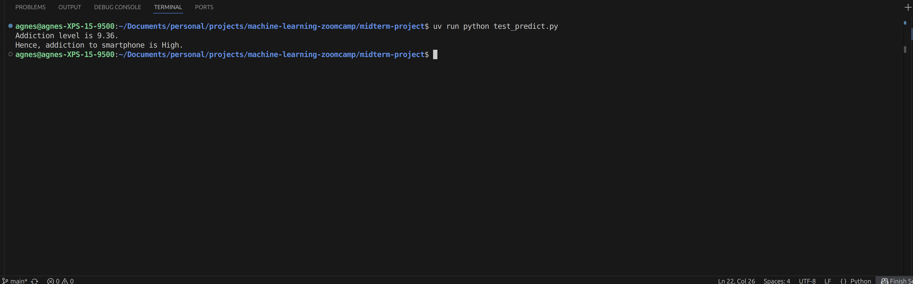
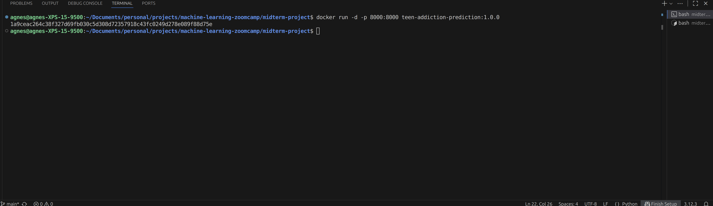
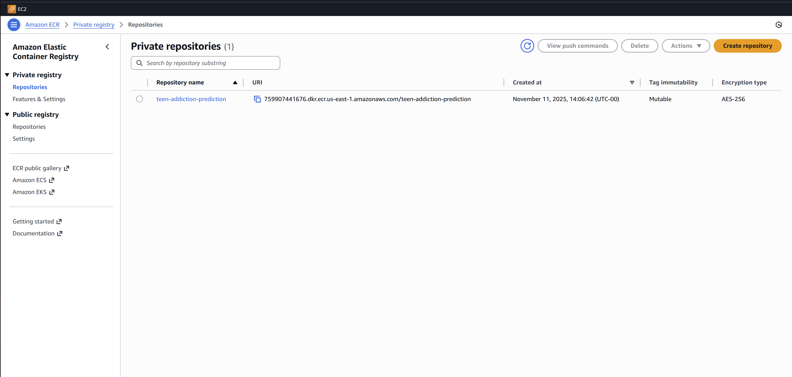
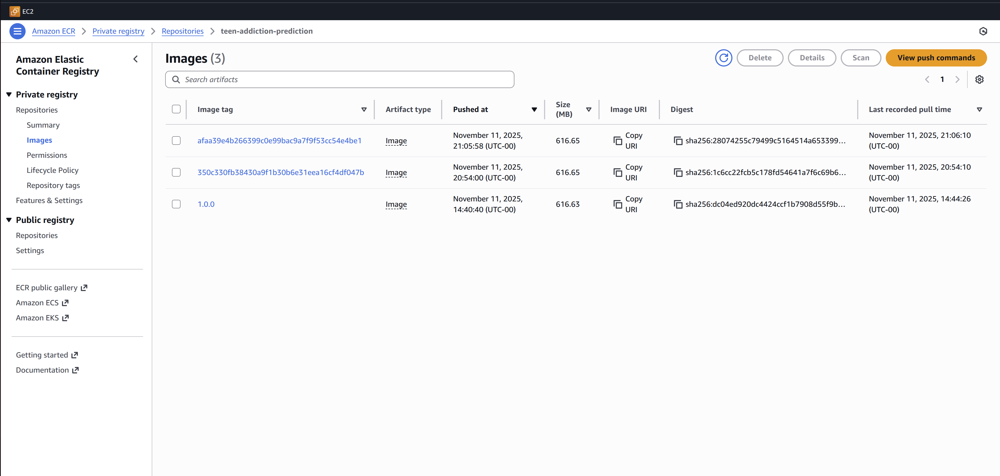
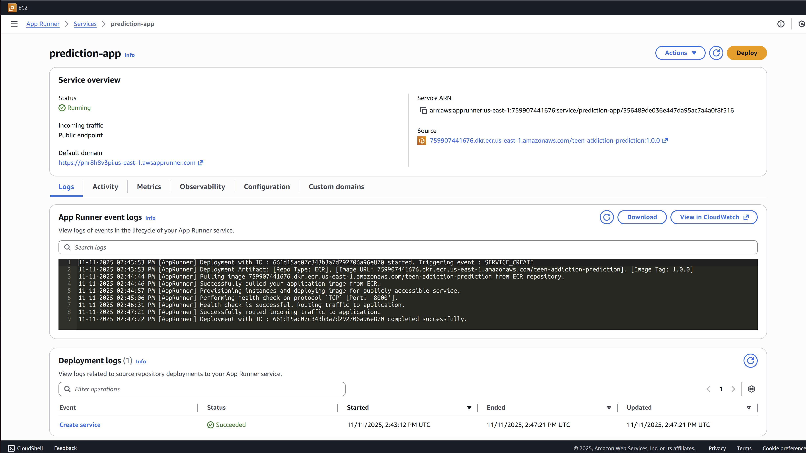
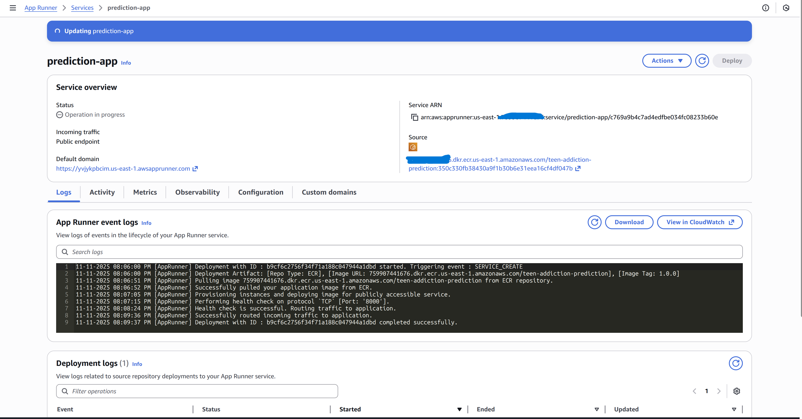

# INTRODUCTION
This is a midterm project for the `Machine Learning Zoomcamp - 2025` to demostrate my understanding being able to:

- Ientify a problem

- Describe the problem

- Determine if the problem can be solved using rule-base approach or Machine Learning

- Train models if using machine learning, and determine the best model following evaluation

- Use the model

# PROBLEM STATEMENT
### Title
Predicting Teens Smartphone Addiction Levels Using Behavioral, Lifestyle, and Mental Health Indicators

### Question
Can we predict a teen’s smartphone addiction level based on their daily phone use, demographics, sleep habits, mental health indicators, parental influence, and lifestyle factors?

### Problem Description
Smartphone use among teenagers has become nearly universal, offering educational and social benefits—but also potential risks related to addiction, sleep deprivation, and mental health issues such as self-esteem, depression, anxiety, social isolation, and so on. Excessive or uncontrolled smartphone use can negatively impact academic performance, relationships, and psychological well-being.

The goal of this project is to develop a predictive model that estimates the `Addiction Level` of teenagers using measurable behavioral, psychological, and lifestyle features such as:

- Demographics such as age and gender

- Daily usage hours (how long they use their phone each day)

- Usage purpose

- Sleep hours

- Time spent on social media / gaming / education

- Social interactions

- Academic performance

- Anxiety and Depression Levels

- Self-esteem

- Parental control

- Phone checks per day

- Number of Apps used

- Weekend usage

- Screen time before bed

By learning patterns in this data, the model can predict which teens are at higher risk of developing smartphone addiction and help inform preventive interventions, counseling programs, and awareness campaigns.

### Type of Problem
This is a `supervised regression` problem, since the target variable Addiction_Level is numeric (e.g., on a scale of 0–10).

Alternatively, it could be converted into a classification problem (e.g., Low, Moderate, High addiction risk).

### Target Variable
Addiction_Level

### How the Model Addresses the Problem

The model’s predictions could be used to:

* Detect early signs of smartphone addiction among teens.

* Personalize interventions: Schools or counselors can focus efforts on high-risk individuals.

* Inform policy: Evidence-based insights can guide screen time recommendations or parental control app designs.

* Educate teens and parents: Help them understand which behaviors (e.g., frequent night-time phone use) increase risk.

This predictive model serves as a decision-support tool, not a replacement for clinical judgment. It quantifies risk and helps prioritize attention toward teens who need support the most.

# IMPLEMENTATION STEPS
To begin, a uv project was initialized within the project's work directory and necessary libraries were installed. This helped to isolate the project and avaoid conflicts in library versions. Next...

### Data Sourcing
The dataset used is the `teen_phone_addiction_dataset` found on Kaggle. This dataset was downloaded and slightly modified. The modified
version of the datase in CSV format used in this project can be found at [teen_phone_addiction_dataset](https://raw.githubusercontent.com/Agnes4Him/project-datasets/refs/heads/main/teen_phone_addiction_dataset2.csv).

## Exploratory Data Analysis
This revealed the following for `Addiction_Level`:
- count - 3000.000000
- mean  - 8.881900
- std   - 1.609598
- min   - 1.000000
- 25%   - 8.000000
- 50%   - 10.000000
- 75%   - 10.000000
- max   - 10.000000

There were no null or duplicate data in the dataset.

## Feature Engineering
An extra column name `Addiction_Category` was added to the dataset to categorize `Addiction_Level`.

## Model Training
This was achieved by splitting the data into train, validation and test datasets.
The following models were trained using train dataset, validated using validation dataset, and their `RMSE` was determined to find the best model for this use case:
- LinearRegressor

- RidgeRegressor

- LassoRegressor

- DecisionTreeRegressor

- RandomForestRegressor

- XGBoost

Different parameters were tested to find the best spot. XGBoost had the best performance.

XGBoost was retrained using a combination of train and validation dataset, and then tested using test dataset. This gave an `RMSE` of `0.659`.

The model was saved locally as `model.bin`using `pickle`.

The notebook used for the training `mid-term.ipynb` was converted to a Python script named `train.py`.

## Web Server
Uisng `FastAPI`, a web server was created to serve the saved model and make predictions on new data. Input validation and type checking was added.
for quality control. The setup was tested by sending a `POST` request from `test_predict.py`.

### Starting Web Server Locally


### Web Server UI - Local


### Test Prediction


## Deployment
Docker was used to containerize the application, and tested locally. The image created was pushed to Amazon ECR to be deployed to a service named `prediction-app` on Amazon App Runner.

### Docker Image


### Docker Run


### Running Container


### ECR repository


### ECR Images


### App Runner Service


### App Runner Overview


## CI/CD
A CI/CD Pipeline was integrated to the project to detect changes in the project's core files, build and push a new image to 
ECR, and update the App Runner Service to reflect the changes.

### CI/CD Trigger


# REPRODUCING PROJECT RESULT
To reproduce the same result, follow these steps:

- Ensure the following prerequisites are met:
* Install `uv` locally

* Install `docker` locally

* Install `aws-cli` locally

* Access to AWS account with `Adminstrator` privilege

* AWS `access key` and `secret key` stored in `~/.aws/credential`

- Locate the project directory - `midterm-project` and change directory to it

```bash
cd midterm-project
```

- Install libraries

```bash
uv sync
```

- Run web server locally

```bash
uv run uvicorn predict:app --host 0.0.0.0 --port 8000 --reload
```

- Test the server on another terminal

```bash
cd midterm-project
uv run python test_predict.py
```

- Dockerize the web server

```bash
docker build -t <IMAGE_NAME>:<TAG> .
```

- Run container locally

```bash
docker run -d -p 8000:8000 <IMAGE_NAME>:<TAG>
```

- Test again

```bash
uv run python test_predict.py
```

- Push image to ECR or any other Docker registry of choice

```bash
aws ecr get-login-password --region us-east-1 | \
docker login --username AWS --password-stdin <AWS_ACCOUNT_ID>.dkr.ecr.us-east-1.amazonaws.com

docker tag teen-addiction-prediction:1.0.0 <AWS_ACCOUNT_ID>.dkr.ecr.us-east-1.amazonaws.com/<IMAGE_NAME>:<TAG>

docker push <AWS_ACCOUNT_ID>.dkr.ecr.us-east-1.amazonaws.com/<IMAGE_NAME>:<TAG>
```

- Create an Amazon App Runner Service and select ECR as container image source

- Use the URL provided to access the web server UI and test prediction again

- Trigger CI/CD pipeline by making changes to any file in the project dolder except the notebook or README.md file

# Limitations and next steps 
The following limitations and next steps to improve on model quality and enhance the performance and reliability of the web server:

- Experiment tracking using `MLFlow`

- Hyperparameter tuning

- Training pipeline using `kubeflow` etc

- Use of a model registry

- Monitoring and Observability